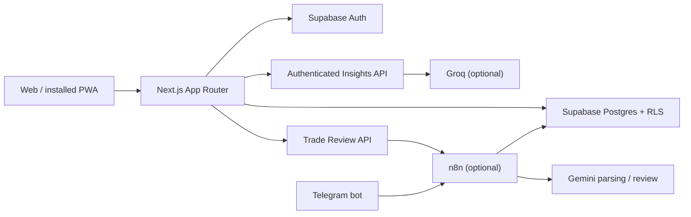

<p align="center">
  
</p>

<p align="center">
  A calm, privacy-conscious personal finance workspace for cash flow, accounts, investments, and trading.
</p>

<p align="center">
  <a href="https://github.com/kuchikamizake05/FinTrack/actions/workflows/ci.yml"></a>
  
  
  
  
  
</p>

---

## Overview

FinTrack brings everyday money management into one focused workspace. It combines a manual financial ledger, account and net-worth tracking, investment execution records, a forex trading journal, verified financial insights, and optional Telegram automation.

The application is designed as a self-hosted personal workspace rather than a bank-connected SaaS product. Financial records are stored in your own Supabase project and protected with Supabase Auth and row-level security (RLS).

### What makes FinTrack different

- **One financial view:** cash flow, balances, liabilities, investments, and trading activity share the same account model.
- **Verified before generated:** Smart Insights calculates metrics locally before an optional AI provider explains them.
- **Journal-first trading:** trade plans, risk, execution results, emotions, and lessons remain the source of truth; AI reviews are advisory only.
- **Automation without credential leakage:** n8n workflows are shipped as inactive, sanitized templates and keep privileged credentials outside the repository.
- **Installable and resilient:** the app includes a web manifest, install icons, a service worker, and a branded offline fallback.

> [!NOTE]
> FinTrack is an Indonesian-first application. An English display option is available for shared navigation and settings surfaces. The product is not a bank-sync service and does not provide financial or investment advice.

## Table of contents

- [Features](#features)
- [Application routes](#application-routes)
- [Architecture](#architecture)
- [Technology stack](#technology-stack)
- [Getting started](#getting-started)
- [Supabase setup](#supabase-setup)
- [Authentication setup](#authentication-setup)
- [Environment variables](#environment-variables)
- [Optional n8n and Telegram automation](#optional-n8n-and-telegram-automation)
- [Available scripts](#available-scripts)
- [Testing and CI](#testing-and-ci)
- [Project structure](#project-structure)
- [Security](#security)
- [Deployment](#deployment)
- [Contributing](#contributing)

## Features

### Personal finance dashboard

- Monthly income, expenses, and net cash flow
- Net-worth overview across assets and liabilities
- Account balance freshness and foreign-currency reporting reminders
- Pending transaction review and financial goal progress
- Recent activity and category-level spending visibility

### Transactions and categories

- Manual income and expense entry
- Search and filters for date, category, type, and status
- Transaction sources for manual entry, Telegram text, and receipt scans
- Review states for unconfirmed or low-confidence automation results
- Soft deletion that preserves ledger history
- Custom categories with icons and colors
- Category identity protection after a category has been used

### Accounts and balances

- Bank, e-wallet, investment, trading, and liability accounts
- IDR and foreign-currency balances with explicit IDR reporting values
- Asset, liability, and net-worth summaries
- Same-currency and cross-currency transfers
- Automatic balance updates backed by database triggers
- Manual balance and equity snapshots

### Investments

- Buy and sell execution journal by broker account
- Quantity, average cost, cost basis, fees, and realized P/L
- Weighted-average position calculations
- Portfolio equity snapshots
- Searchable execution history

### Trading journal

- Long and short forex trade records
- Entry, exit, stop loss, take profit, lot size, commission, and swap
- Initial risk, net P/L, R-multiple, win rate, and average R
- Setup tags, entry thesis, emotions, and lessons
- On-demand and weekly AI review workflows through n8n
- Advisory reviews stored separately from the original journal

### Smart Insights

- Deterministic current-versus-previous-period analysis
- Savings rate, cash-flow direction, category concentration, and spending movement
- Prioritized actions linked back to the relevant FinTrack page
- Optional Groq-generated explanations based on bounded aggregate data
- Authenticated, rate-limited, no-store API responses
- Deterministic fallback when the AI provider is unavailable

### Authentication and PWA

- Email/password sign-in, account creation, and password recovery
- Optional Google OAuth through Supabase Auth
- Protected application routes and onboarding boundaries
- Installable PWA with standalone display mode
- Branded offline navigation fallback
- Desktop and mobile-responsive layouts

## Application routes

| Route | Purpose |
| --- | --- |
| `/` | Marketing landing page |
| `/login` | Email/password and Google authentication |
| `/onboarding` | First account and transaction setup |
| `/dashboard` | Financial overview and next actions |
| `/transactions` | Transaction ledger, filters, and manual entry |
| `/accounts` | Accounts, balances, net worth, and transfers |
| `/categories` | Income and expense category management |
| `/investments` | Stock execution journal and portfolio snapshots |
| `/trading` | Forex journal, analytics, and AI review requests |
| `/insights` | Verified metrics and optional AI explanations |
| `/settings` | Session, language, environment, and integration guidance |
| `/offline` | PWA offline fallback |

## Architecture



The codebase keeps delivery, domain, infrastructure, and server-only concerns separate:

- `src/app` contains pages and authenticated route handlers.
- `src/components` contains shared React UI and application boundaries.
- `src/lib` contains deterministic business rules without React or Supabase dependencies.
- `src/infrastructure/supabase` owns browser and server Supabase clients.
- `src/config` validates public configuration and builds security headers.
- `src/server` contains reusable server-only HTTP helpers.

See [the architecture guide](docs/architecture.md) for dependency rules and the request lifecycle.

## Technology stack

| Layer | Technology |
| --- | --- |
| Framework | Next.js 16 App Router |
| UI | React 19, Tailwind CSS 4, Lucide React |
| Forms and validation | React Hook Form, Zod |
| Charts | Recharts |
| Authentication and database | Supabase Auth, Postgres, RLS |
| AI insights | Groq API (optional) |
| Automation | n8n, Telegram Bot API, Gemini API (optional) |
| Unit testing | Vitest |
| End-to-end testing | Playwright |
| CI | GitHub Actions |
| Deployment target | Vercel or any Node.js-compatible platform |

## Getting started

### Prerequisites

- Node.js **20.9.0 or newer**
- npm
- A Supabase project
- Git

Optional integrations require an n8n instance, Telegram bot, Gemini API key, and/or Groq API key.

### 1. Clone and install

```bash
git clone https://github.com/kuchikamizake05/FinTrack.git
cd FinTrack
npm ci
```

### 2. Create the local environment file

macOS or Linux:

```bash
cp .env.example .env.local
```

Windows PowerShell:

```powershell
Copy-Item .env.example .env.local
```

Replace every placeholder required by the integrations you plan to use. Never commit `.env.local`.

### 3. Prepare Supabase

Run [the base schema](supabase/schema.sql), then every file in [`supabase/migrations/`](supabase/migrations/) in filename order. Detailed instructions are provided in [Supabase setup](#supabase-setup).

### 4. Start development

```bash
npm run dev
```

Open [http://localhost:3000](http://localhost:3000).

## Supabase setup

FinTrack uses Supabase for both identity and data ownership. A configured Supabase project is required for the authenticated application.

1. Create a new Supabase project.
2. Open **SQL Editor** in the Supabase dashboard.
3. Execute [`supabase/schema.sql`](supabase/schema.sql).
4. Execute every migration in [`supabase/migrations/`](supabase/migrations/) in ascending filename order.
5. Confirm that RLS is enabled for the created tables.
6. Copy the project URL and anon key from **Project Settings > API** into `.env.local`.

The schema and migrations create the financial ledger, account transfers, goals, investment executions, forex journal, equity snapshots, and AI trade review storage. Ownership policies are based on the authenticated user's `auth.uid()`.

> [!IMPORTANT]
> Do not edit a migration after it has been applied. Add a new dated migration for subsequent database changes.

### Storage for receipt automation

If the Telegram receipt workflow is enabled, create a private Supabase Storage bucket named `receipts-temp`. Apply a narrow policy appropriate for the n8n service role and your retention requirements. Receipt images and temporary OCR data must not be public by default.

## Authentication setup

### Email and password

1. Open **Authentication > Providers > Email** in Supabase.
2. Enable email/password authentication.
3. Decide whether new accounts must confirm their email address.
4. If email templates are customized, preserve `{{ .RedirectTo }}` in confirmation and recovery links.

### Google OAuth

1. Create a **Web application** OAuth client in Google Auth Platform.
2. In Supabase, open the Google provider and copy its callback URL.
3. Add that callback URL as an authorized redirect URI in Google.
4. Store the Google Client ID and Client Secret in Supabase—not in this repository or the Next.js environment.
5. Enable the Google provider in Supabase.

### Redirect URLs

In **Authentication > URL Configuration**, add the URLs used by your environments, for example:

```text
http://localhost:3000/**
https://your-preview-domain.example/**
https://your-production-domain.example/**
```

Use the stable production origin as the Supabase Site URL after the application has a permanent domain.

## Environment variables

The canonical template is [`.env.example`](.env.example).

| Variable | Required | Scope | Purpose |
| --- | --- | --- | --- |
| `NEXT_PUBLIC_SUPABASE_URL` | Yes | Browser-safe | Supabase project URL |
| `NEXT_PUBLIC_SUPABASE_ANON_KEY` | Yes | Browser-safe | Supabase anon key; safe only with correct RLS policies |
| `GROQ_API_KEY` | For AI insights | Server only | Generates the optional Smart Insights explanation |
| `GROQ_INSIGHTS_MODEL` | No | Server only | Groq model ID; defaults to `openai/gpt-oss-20b` |
| `N8N_TRADE_REVIEW_WEBHOOK_URL` | For trade review | Server only | n8n webhook receiving authenticated review jobs |
| `N8N_TRADE_REVIEW_SHARED_SECRET` | For trade review | Server only | Shared secret sent to and verified by n8n |

Variables prefixed with `NEXT_PUBLIC_` are included in the browser bundle by design. Provider keys, service-role keys, webhook secrets, and OAuth client secrets must never use that prefix.

## Optional n8n and Telegram automation

The [`n8n/`](n8n/) directory contains sanitized and inactive workflow templates:

| Workflow | Purpose |
| --- | --- |
| `telegram-text-workflow.json` | Parse a Telegram text message and create a transaction |
| `telegram-receipt-workflow.json` | Download a receipt, run OCR, and store structured transaction data |
| `forex-trade-review-workflow.json` | Generate an on-demand advisory review for one trade |
| `forex-weekly-review-workflow.json` | Generate and store a weekly trading review |

### n8n environment

Configure the required values in the n8n secret/environment store—not inside exported workflow JSON:

| Variable | Used by |
| --- | --- |
| `TELEGRAM_ALLOWED_USER_ID` | Telegram allowlist |
| `GEMINI_API_KEY` | Text parsing, OCR, and trade reviews |
| `SUPABASE_URL` | Supabase REST and Storage endpoints |
| `SUPABASE_SERVICE_ROLE_KEY` | Privileged server-side n8n access |
| `SUPABASE_USER_ID` | Owner assigned to automated records |
| `N8N_TRADE_REVIEW_SHARED_SECRET` | Validates requests from the FinTrack server |

After importing a template:

1. Attach the correct Telegram credential to Telegram nodes.
2. Restrict the bot with `TELEGRAM_ALLOWED_USER_ID`.
3. Verify the Supabase user ID that will own generated records.
4. Match the trade review shared secret with the application environment.
5. Test with dummy financial data.
6. Activate the workflow only after every success and failure path has been reviewed.

Never export live n8n credentials. Use the `.private.json` suffix for local private exports so Git ignores them.

## Available scripts

| Command | Description |
| --- | --- |
| `npm run dev` | Start the Next.js development server |
| `npm run build` | Create a production build |
| `npm run start` | Serve the production build |
| `npm run lint` | Run ESLint |
| `npm run typecheck` | Run TypeScript without emitting files |
| `npm test` | Run the Vitest unit suite once |
| `npm run test:coverage` | Run unit tests with coverage |
| `npm run test:e2e` | Run Playwright across desktop and mobile projects |
| `npm run test:e2e:list` | List all discovered Playwright tests |
| `npm run check` | Run lint, typecheck, unit tests, and production build |
| `npm run audit:security` | Audit production dependencies at high severity or above |

Playwright starts its own production server on port `3100`; do not start the application manually before running E2E tests.

## Testing and CI

Before opening a pull request, run:

```bash
npm run check
npm run audit:security
npm run test:e2e
```

The test suite covers deterministic finance calculations, configuration and security boundaries, authentication, onboarding, application smoke routes, Smart Insights, production headers, PWA behavior, and responsive overflow.

GitHub Actions runs three jobs on pull requests and pushes to `main`:

- **Quality:** lint, typecheck, unit tests, and production build
- **Security:** production dependency audit
- **E2E:** Playwright tests against a production build on desktop and mobile Chromium

Playwright reports are uploaded as CI artifacts even when E2E tests fail.

## Project structure

```text
FinTrack/
|-- .github/workflows/       GitHub Actions CI
|-- docs/                    Architecture documentation
|-- e2e/                     Playwright specs and controlled fixtures
|-- n8n/                     Sanitized workflow templates
|-- public/                  Brand assets, PWA icons, and service worker
|-- src/
|   |-- app/                 App Router pages and API routes
|   |-- components/          Shared components and UI primitives
|   |-- config/              Configuration and security headers
|   |-- infrastructure/      Supabase client boundaries
|   |-- lib/                 Domain rules and calculations
|   |-- server/              Server-only HTTP helpers
|   `-- types/               Global declarations
|-- supabase/
|   |-- migrations/          Ordered, immutable database migrations
|   `-- schema.sql           Base schema and RLS policies
|-- .env.example             Safe environment template
|-- next.config.ts           Next.js and security-header configuration
|-- playwright.config.ts     E2E projects and production test server
`-- package.json             Scripts and dependency manifest
```

## Security

FinTrack handles personal financial information and treats public and private execution boundaries explicitly:

- Supabase RLS restricts records by authenticated user ownership.
- API routes authenticate access tokens independently and validate resource ownership.
- App-owned API responses use no-store caching policies.
- Security headers include a constrained Content Security Policy and related browser protections.
- Smart Insights receives bounded aggregate metrics instead of raw transaction records.
- n8n service-role credentials remain in the automation environment only.
- `.env.local`, exports, receipts, database dumps, and private workflow files are ignored by Git.

Do not report vulnerabilities in a public issue. Follow [SECURITY.md](SECURITY.md) and use the repository's private security reporting channel.

## Deployment

FinTrack can run on Vercel or another Node.js-compatible platform.

### Vercel

1. Import the GitHub repository into Vercel.
2. Keep the detected Next.js build settings.
3. Add the required environment variables for Preview and Production.
4. Add the Vercel preview and production origins to the Supabase redirect allowlist.
5. Deploy, then verify authentication, security headers, PWA assets, and API integrations.

Use Node.js 22 to match the current CI environment, or any supported runtime satisfying the project's `>=20.9.0` engine requirement.

When self-hosting, place the app behind HTTPS and keep n8n on a separately protected origin. Never expose an n8n editor, Supabase service-role key, or private webhook without authentication.

## Contributing

1. Create a focused branch from the latest `main`.
2. Keep domain calculations deterministic and covered by unit tests.
3. Add or update Playwright coverage for user-visible flows.
4. Preserve the client/server and public/private configuration boundaries documented in [the architecture guide](docs/architecture.md).
5. Run the complete validation commands before opening a pull request.
6. Explain database migration and environment changes explicitly in the pull request description.

Financial data, credentials, receipts, local exports, and private automation state must never be included in a contribution.

---

<p align="center">
  Built for clearer decisions, calmer reviews, and financial data that stays under your control.
</p>
